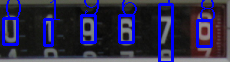

## About
This is a flask application that designed to recognize digits from photos or videos by using [OpenCV](https://opencv.org/) ([library](https://pypi.org/project/opencv-python/)) and [Tesseract-ocr](https://github.com/tesseract-ocr/tesseract) ([library](https://pypi.org/project/pytesseract/)).
The idea is to provide a POC for a digit recognition service. 

OpenCV is used to prepare visual data for recognition.
Which means increasing contrast and applying visual filters and cropping images for exact zone where the digits are.
Frontend side cropping is managed by [CropperJS](https://github.com/fengyuanchen/cropperjs) which provides backend with coordinates of the desired location on the image or video.

The digit recognition is done by Tesseract-ocr. 
It was chosen as already working ocr but preferably would be training a custom model for the individual type of task.

Photo recognition is simple and straightforward. The app just task one images recognizes the digits and returns the result.

Video recognition works by recognizing every tenth frame in the set zone and returning up to ten first results.
The reason it is limited is because recognition of multiple frames takes a far too long to be considered reasonable.

The goal is to handle and recognize a video stream from a camera setup to monitor constantly changing digits (like a meter).
To have input from the real world to digital, which can be used to track and administer this information.